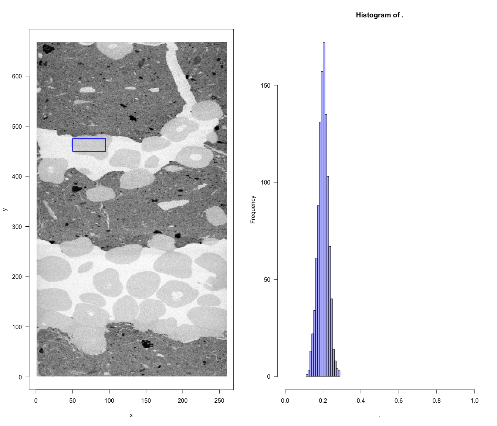
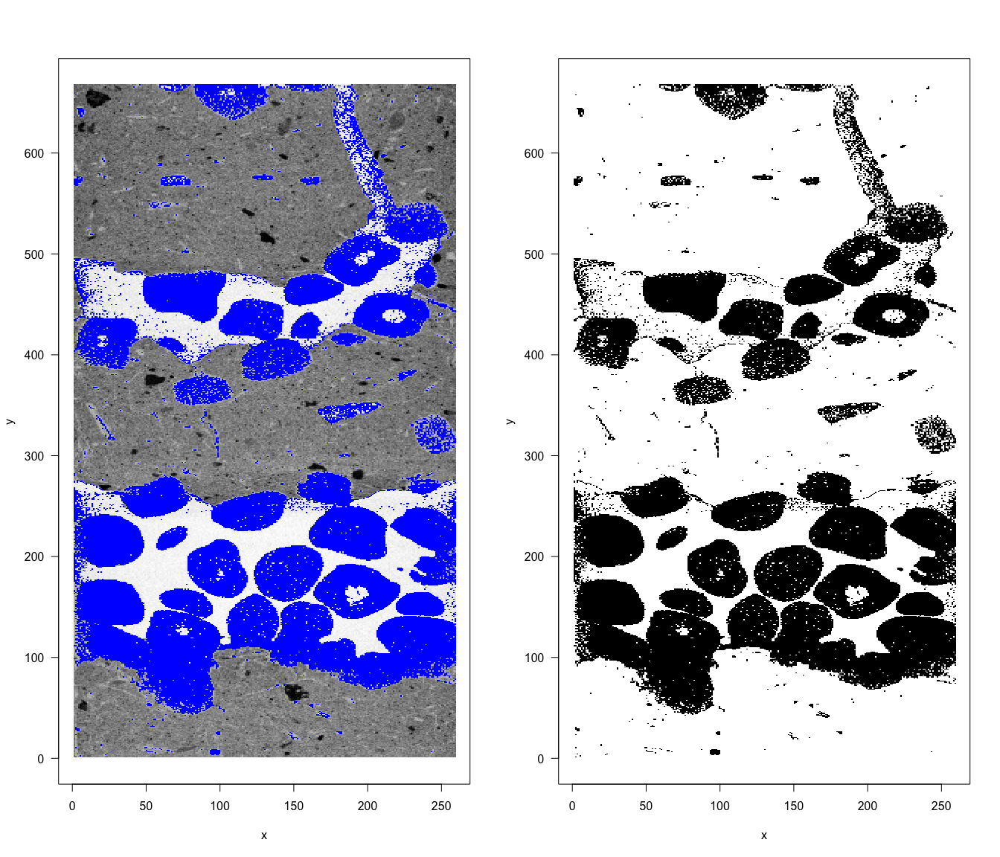
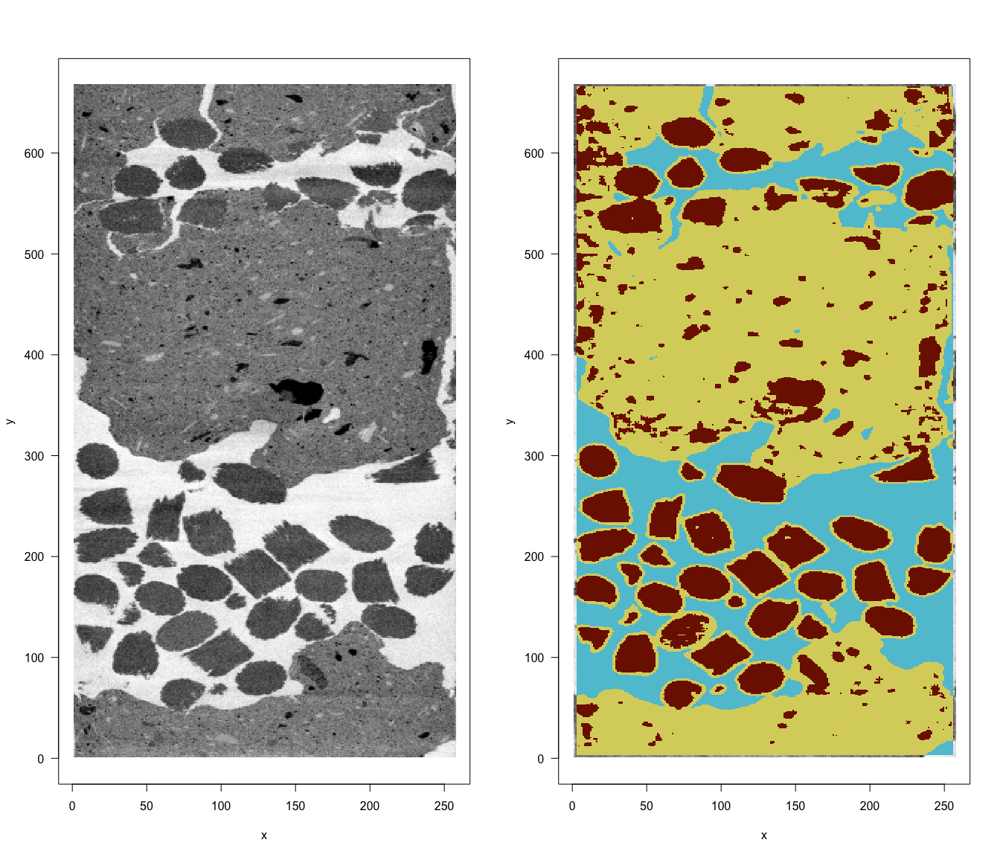

Analysis of CT scan data using PCA and kmeans
================
RKOpTris
2024-04-17

## Abstract

A PhD student under my supervision was investigating the use of CT scans
for measuring microplastic abundance in soil cores. The CT images
essentially comprised the microplastics, the soil and voids (air
pockets) in the soil. There was overlap in the greyscale values of the
those components of the cores, so I tried using PCA + kmeans to see
whether, in tandem, they could effectively separate out those three
components.

## Introduction

CT measures the density of components in a solid volume, producing
individual slices of data as it scans through the volume. You end up
with a many greyscale images where whiter pixels indicate materials of
greater density. These 2D images can be stacked to produce a 3D
volumetric dataset. As different materials have different densities, the
shade of grey can be used to identify certain materials.

When the first images came through I had a go at writing some R code
that might be able to separate the three components of the soil cores,
which were the microsplastics (which we were most interesed in), the
soil and the voids of air in the soil. If that could be done effectively
using an image, then it might be possible to estimate the mass of
microsplastic within the volume. I’d never tried to do such a thing, and
this idea came as a whim, so I decided to make it an interesting
exercise. I had some success and share here the methods and analysis.

The CT images used here, and generally for more information, you can
look at the paper (Trusler et al., 2023) which is included in the
reference list at the end of this document.

## Methods and code

We’ll start by loading some libraries that I’ll be using.

``` r
library(dplyr)
```

    ## 
    ## Attaching package: 'dplyr'

    ## The following objects are masked from 'package:stats':
    ## 
    ##     filter, lag

    ## The following objects are masked from 'package:base':
    ## 
    ##     intersect, setdiff, setequal, union

``` r
library(pixmap)
library(parallel)
library(purrr)
library(reshape2)
library(scico)
library(ggplot2)
```

The first thing to notice is these files are pretty large images,
containing 2764048 pixels!

``` r
original_pixel_count <- read.pnm("Microplastics core 2.ppm")@size %>% prod()
```

    ## Warning in rep(cellres, length = 2): 'x' is NULL so the result will be NULL

``` r
original_pixel_count
```

    ## [1] 2764048

To make this script run faster, we’ll reduce the resolution using these
functions. rotate() simply rotates the image matrix (which consists of a
2D arrangement of greyscale values), and mat_cell_avg() averages groups
of n-squared pixels using the parameter “spread”. There’s quite a lot of
image to process so we’ll parallelise the function.

``` r
# this just rotates the image matrix so it's in the correct orientation
rotate <- function(x) t(apply(x, 2, rev))

# reduce the resolution by averaging (1 + spread)^2 pixels, if the amounts of rows and columns are not divisible by spread + 1 (capture in the function) then they are first trimmed from the image
mat_cell_avg <- function(mat, spread = 1){
  capture <- 1 + spread
  diffrows <- nrow(mat) %% capture
  if(diffrows != 0){
    mat <- mat[-(rev(1:nrow(mat))[1:diffrows]), ]
    warning(paste0("There were ", 
                   diffrows, 
                   " excess rows which were trimmed from the end of the data"))
  }
  diffcols <- ncol(mat) %% capture
  if(diffcols != 0){
    mat <- mat[, -(rev(1:ncol(mat))[1:diffcols])]
    warning(paste0("There were ", 
                   diffcols, 
                   " excess columns which were trimmed from the end of the data"))
  }
  matseqc <- seq(capture, ncol(mat), by = capture) - spread
  matseqr <- seq(capture, nrow(mat), by = capture) - spread
  p0 <- expand.grid(x0 = matseqc, y0 = matseqr)
  p1 <- p0 + spread
  names(p1) <- c("x1", "y1")
  matseqtab <- cbind(p0, p1)
  matseqtab$xnew <- matseqtab$x1/capture
  matseqtab$ynew <- matseqtab$y1/capture
  matseqtab$value <- NA
  matseqlist <- apply(matseqtab[, 1:4], 1, as.list)
  matseqlist <- lapply(matseqlist, as.numeric)
  matseqtab$value <- as.numeric(mclapply(matseqlist, function(x){mean(mat[x[2]:x[4], x[1]:x[3]])}))

  matrix(matseqtab$value, ncol = max(matseqtab$xnew), byrow = T)
}
```

read.pnm(), the function we’ll use to read in the CT scan files reads in
3 colour channels, but as the CT image is in greyscale and those
channels all contain the same values we can choose any channel. In this
case the red channel. We then call the two functions we created above
using a new function, reduce_resoltion(), which will rotate the input
file and average the cells according to the spread parameter. The
resulting image will contain approximately (1 + spread)^2 fewer pixels.

``` r
reduce_resolution <- function(ppm, spread = 1){
  mp <- read.pnm(ppm)
  mp <- mp@red
  mp <- rotate(mp)
  mat_cell_avg(mp, spread = spread)
}

mp <- reduce_resolution("Microplastics core 2.ppm", spread = 3)
```

    ## Warning in rep(cellres, length = 2): 'x' is NULL so the result will be NULL

This is now the number of pixels (greyscale values) in the matrix:

``` r
(new_res_pixels <- length(mp))
```

    ## [1] 172753

``` r
original_pixel_count /  new_res_pixels
```

    ## [1] 16

The image is 16X smaller. Phew! Now, for plotting we’ll create another
image by melting the image into x (Var1), y (Var2), and (greyscale)
value.

``` r
mpmelt <- reshape2::melt(mp)
head(mpmelt)
```

    ##   Var1 Var2     value
    ## 1    1    1 0.5164216
    ## 2    2    1 0.1860294
    ## 3    3    1 0.3338235
    ## 4    4    1 0.4700980
    ## 5    5    1 0.3372549
    ## 6    6    1 0.4181373

Here we’ll write a simple function to plot the image. It can convert the
image into a negative as some CT images can be dark and harder to see,
and it converts the decimal greyscale value into a hexidecimal one which
is suitable for plotting.

``` r
plot_ct <- function(mpmelt, blank = F, image_negative = F){
  if(image_negative){mpmelt$value <- 1 - mpmelt$value}
  mpmelt$value <- paste0("#000000", toupper(as.hexmode(round(mpmelt$value * 255))))
  plot(mpmelt$Var1, mpmelt$Var2, type = "n", xlab = "x", ylab = "y", las = 1)
  if(!blank){
    rect(mpmelt$Var1, mpmelt$Var2, mpmelt$Var1 + 1, mpmelt$Var2 + 1, col = mpmelt$value,         border = NA)
  }
}
```

And now let’s plot the CT scan. Note the inline comments in the code
below.

The microplastics are the mid-grey particles in amongst the light grey
voids, sandwiched between the darker grey soil/sediment. To our eyes, it
looks like a fairly consistent shade, so perhaps we should be able just
to group the microplastics based on their shade of grey. If we take a
section of the microplastic and make a histogram of range of grey
values. They’re all of a certain range, so can we just use those ranges
to identify the microplastic?

``` r
par(mfrow = c(1, 2))
# here's the ct scan of the core containing the microplastics that appear as mid-grey blobs
plot_ct(mpmelt)
# it looks like we can pick them out based on colour
xleft = 50; xright = 95; ybottom = 450; ytop = 475
# so let's have a closer look at one of the particles
rect(xleft, ybottom, xright, ytop, lwd = 2, border = "#0000FF")
grey_values <- mpmelt %>% filter(Var1 > xleft & Var1 < xright & Var2 > ybottom & Var2 < ytop)
# there's a range of grey values
grey_values %>% pull(value) %>% hist(breaks = 20, las = 1, xlim = c(0, 1), col = "#0000FF55")
```

<!-- -->

``` r
check_grey <- mpmelt[mpmelt$value > min(grey_values$value) & mpmelt$value < max(grey_values$value), ]
```

Unfortunately it isn’t that simple. We can’t simply take those grey
values as they occur in other parts of the scan which do not pertain to
microplastics, but rather areas of certain densities similar to the
microplastic. And there’s also a graininess in the image, with the
microplastic greys occuring throughout the core as individual pixels.
The situation is similar for the other core components; the soil and the
voids.

``` r
par(mfrow = c(1, 2))
plot_ct(mpmelt)
rect(check_grey$Var1, check_grey$Var2, check_grey$Var1 + 1, check_grey$Var2 + 1, col = "#0000FF", border = NA)
# when the background is removed we can see that it's not picking out just the microplastics particles, or that pixels are missing inside some of them
plot_ct(mpmelt, blank = T)
rect(check_grey$Var1, check_grey$Var2, check_grey$Var1 + 1, check_grey$Var2 + 1, col = "#000000", border = NA)
```

<!-- -->

But we can use our eyes to guide us and inform what approach we could
take with a model; there are, after all, continuous areas of certain
shades of grey. We can work with that particlar feature of the data.

We don’t actually need prior knowledge of what those shades are. An
approach we can take is to look at pixels and their neighbours
(read_pixels()) and group them according to their neighbourhoods by
using PCA (principal components analysis), i.e., we can think of the
pixels of the microplastic particles as being related to one another;
pixels pertaining to microplastics particles should have neighbouring
pixels within the range of the greyscale we discovered above to get the
values of a pixel’s nearest neighbours. But let’s get the computer to do
this. Using these two functions:

``` r
# show a pca!
read_pixels <- function(mat, n, spread = 2){
  init_row <- c(n, n + (1:spread * nrow(mat)), n - (1:spread * nrow(mat)))
  c(
    init_row,
    sapply(1:spread, function(x){init_row + x}),
    sapply(1:spread, function(x){init_row - x})
  ) %>% sort()
}

ct_pca <- function(mp, spread = 1){
  pixel_ids <- matrix(1:length(mp), nrow = nrow(mp), ncol = ncol(mp))
  xminexc <- unique(mpmelt$Var1)[1:spread]
  xmaxexc <- rev(unique(mpmelt$Var1))[1:spread]
  xexc <- sort(c(xminexc, xmaxexc))
  yminexc <- unique(mpmelt$Var2)[1:spread]
  ymaxexc <- rev(unique(mpmelt$Var2))[1:spread]
  yexc <- sort(c(yminexc, ymaxexc))
  cropped_pixels <- pixel_ids[-xexc, -yexc]
  pixel_seq <- sort(as.numeric(cropped_pixels))
  pixel_groups <- mclapply(pixel_seq, function(n){c(n, mp[read_pixels(mp, n, spread = spread)])})
  pixel_groups <- do.call(rbind, pixel_groups)
  names(pixel_groups) <- c("pixel_ID", paste0("pixel", 1:(ncol(pixel_groups) + 1)))
  pixel_pca <- prcomp(pixel_groups[, 2:ncol(pixel_groups)], center = T)
  list(pixel_ids = pixel_ids, cropped_pixels = cropped_pixels, pixel_pca = pixel_pca)
}
```

After the PCA has determined which pixels are more similar to others, we
can use kmeans clustering to identify which of, in this case, 3 groups,
each pixel belongs to. We’re using 3 groups because we can identify 3
main components of the core (microplastics/soil/voids) which correspond
to shades of grey in the CT image. This is the function that will run
the kmeans cluster analysis:

``` r
ct_cluster <- function(pixel_pca, n_clusters = 3, n_start = 5){
  kp <- kmeans(pixel_pca$x, centers = n_clusters, nstart = n_start)
  print(table(kp$cluster))
  kp
}
```

And finally, we want to visualise the PCA + kmeans groups, so we can
overlay that data onto the CT image.

``` r
ct_cluster_overlay <- function(mpmelt, n_clusters = 3, alpha = 1){
  mpmelt_col <- mpmelt
  mpmelt_col$id <- sapply(1:nrow(mpmelt), function(x){pixel_ids[mpmelt$Var1[x], mpmelt$Var1[x]]})
  mpmelt_col <- mpmelt_col
  mpmelt_col$cluster <- NA
  mpmelt_col$cluster[pixel_ids %in% cropped_pixels] <- kp$cluster
  mpmelt_col$col <- NA
  mpmelt_col$col[pixel_ids %in% cropped_pixels] <- scico::scico(n_clusters + 1, palette = "roma")[1:n_clusters][kp$cluster]
  mpmelt_col$col[which(!is.na(mpmelt_col$col))] <- paste0(mpmelt_col$col[which(!is.na(mpmelt_col$col))], as.hexmode(round(255 * alpha)))
  rect(mpmelt$Var1, mpmelt$Var2, mpmelt$Var1 + 1, mpmelt$Var2 + 1, col = mpmelt_col$col, border = NA)
}
```

And this is what we get:

``` r
ct_pca_dat <- ct_pca(mp, spread = 2)
pixel_pca <- ct_pca_dat$pixel_pca
cropped_pixels <- ct_pca_dat$cropped_pixels
pixel_ids <- ct_pca_dat$pixel_ids

kp <- ct_cluster(pixel_pca)
```

    ## 
    ##     1     2     3 
    ## 91633 50707 26725

``` r
par(mfrow = c(1, 2))
plot_ct(mpmelt)
plot_ct(mpmelt)
ct_cluster_overlay(mpmelt)
```

<!-- -->

Not bad, but there is are noticeable outlines where one component meets
another. We can try the same process with another CT image:

``` r
mp <- reduce_resolution("Microplastics core 1.ppm", spread = 3)
```

    ## Warning in rep(cellres, length = 2): 'x' is NULL so the result will be NULL

``` r
mpmelt <- reshape2::melt(mp)
ct_pca_dat <- ct_pca(mp, spread = 2)
pixel_pca <- ct_pca_dat$pixel_pca
cropped_pixels <- ct_pca_dat$cropped_pixels
pixel_ids <- ct_pca_dat$pixel_ids

kp <- ct_cluster(pixel_pca)
```

    ## 
    ##     1     2     3 
    ## 37336 93266 37137

``` r
par(mfrow = c(1, 2))
plot_ct(mpmelt)
plot_ct(mpmelt)
ct_cluster_overlay(mpmelt)
```

<!-- -->

The method worked reasonably well in this second image but not as well
as the first. There are outlines around the microplastic particles which
aren’t a genuine feature.

## Conclusion

This was just a bit of fun to see if I could estimate the areas of the
key components of a soil core from a CT image using a bit of
computation. Of course, there are already excellent softwares that
already do this (and are far more sophisticated and do it much better!)
but I wanted to see if it could be done with a couple of out-of-the-box
unsupervised learning techniques. It is interesting to see what can be
done with simple(-ish!) computation as employing supervised machine
learning techniques such as neural nets require lots of labelled
training data, and that takes time and people to do!

## References

Megan M. Trusler, Craig J. Sturrock, Christopher H. Vane, Sarah Cook,
Barry H. Lomax, 2023. X-ray computed tomography: A novel non-invasive
approach for the detection of microplastics in sediments? Marine
Pollution Bulletin 194(A), 115350.
<https://doi.org/10.1016/j.marpolbul.2023.115350>

Abstract: As a non-invasive imaging technique, this study explores the
application of Computed Tomography (CT) in microplastics research,
assessing its potential to distinguish different types and sizes of
microplastics (polypropylene, polyethylene terephthalate, polyethylene,
and polyvinyl chloride) from homogenised river-estuarine sediment. When
examined in layers within artificial cores, all microplastic types could
be observed by CT imagery, with good contrast in X-ray attenuation
(based on image gray level intensity) against background sediments.
Large microplastics (4 mm diameter) were also detectable when
distributed randomly amongst the sediment. These spiked cores had
sufficient difference in attenuation to allow segmentation between type,
and therefore isolate individual microplastics. Due to limitations on
scan resolution, smaller microplastics (≤125 μm diameter) could not be
detected in spiked cores. Scans of two sediment cores from a Thames
River tributary (UK) revealed two distinctive sediment structures which
could influence microplastic accumulation. This information would be
lost using conventional recovery procedures.
